# seapol demo gallery

Each script writes its figures to `output/`.  Scripts marked (ASIT) need
the ASIT 2019 data trees on disk; scripts marked (table) build or load
the cached deep FM98 table `output/fm98_table_deep.npz`.

`uv run demos/run_all.py` runs the whole gallery in dependency order,
capturing each demo's output to `output/logs/<name>.log` and
auto-skipping demos whose data requirements are missing (`--list` shows
the registry and status, `--only SUBSTR` filters, `--fail-fast` stops
at the first failure, `--verbose` streams output instead of logging).  Single
demos run the same way: `uv run demos/demo_render_panel.py`.

The figures below live in `gallery/` (tracked); refresh them after
regenerating demos with `uv run demos/update_gallery.py`.

## Measure-from-light: polarimetric reconstruction

| Script | What it shows |
|---|---|
| `demo_polarimetric_reconstruction.py` | The full slope-sensing loop with known truth: overcast-sky polarized imagery is inverted per facet (DoLP -> Fresnel incidence angle, AoP -> plane of incidence) into slope fields, then spectrally integrated to height. Recovered MSS, slope PDFs (including the non-Gaussian tails), Hs, height PDF, and omnidirectional spectrum overlay the truth (corr 0.9999, Hs to 0.1%). |
| `demo_polarimetric_polarized.py` | Reconstruction under a CLEAR (polarized) sky at 30 deg incidence -- the DoFP field geometry, where the DoLP-based unpolarized inversion is biased. `slopes_from_stokes_polarized` inverts the full Mueller chain against the known sky (Gauss-Newton), recovering slopes (corr 1.000, height corr 1.0000) where the unpolarized model is off. |

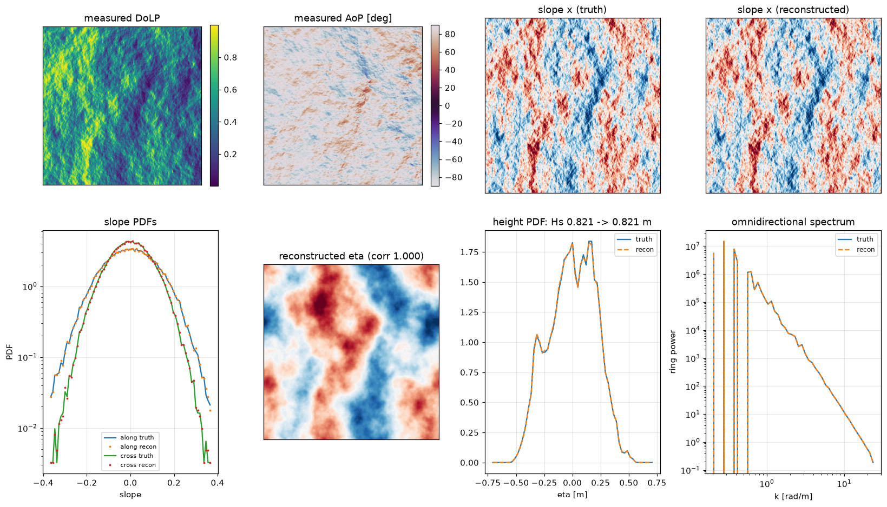
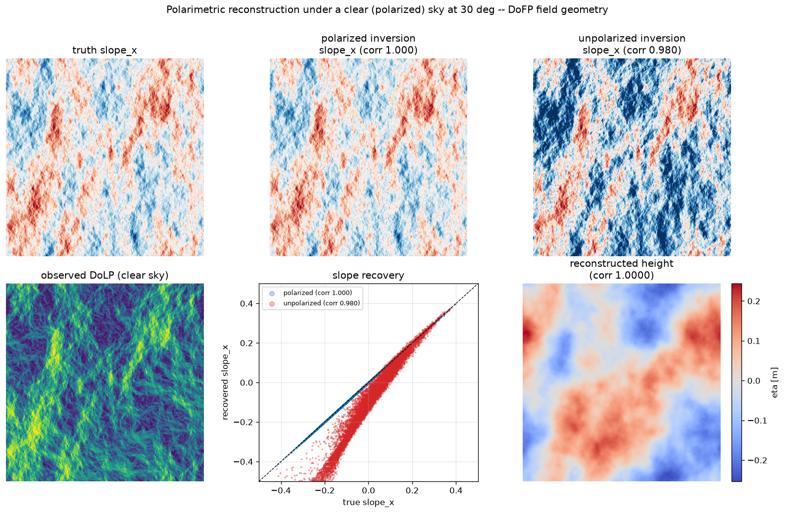

## Rendering and light modeling

| Script | What it shows |
|---|---|
| `demo_render_panel.py` | Polarization image panel (I/Q/U, DoLP, AoP) of an Elfouhaily surface under a Rayleigh sky. |
| `demo_time_evolution.py` | Time-evolving surface with per-frame facet Stokes rendering; PNG strip + GIF. |
| `demo_glint_foam_current.py` | Gram-Charlier glint asymmetry (skewed sub-pixel slopes shift/tilt the glitter lobe), whitecap foam riding the steepest facets (Monahan coverage, depolarizing), and the uniform-current Doppler of the k-f dispersion ridge. |
| `demo_sky_water_gallery.py` | Rendered imagery across sky types (clear + analytic Cox-Munk glint, partly cloudy, overcast) with Case 1 water-leaving radiance. |

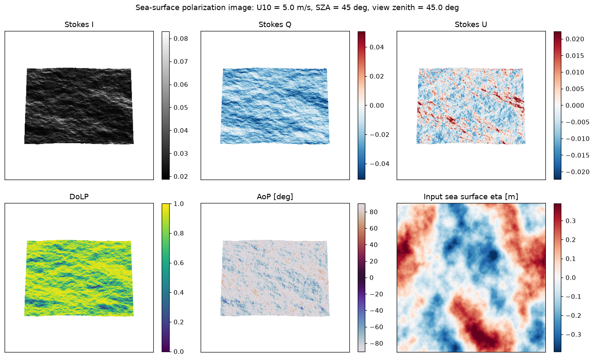
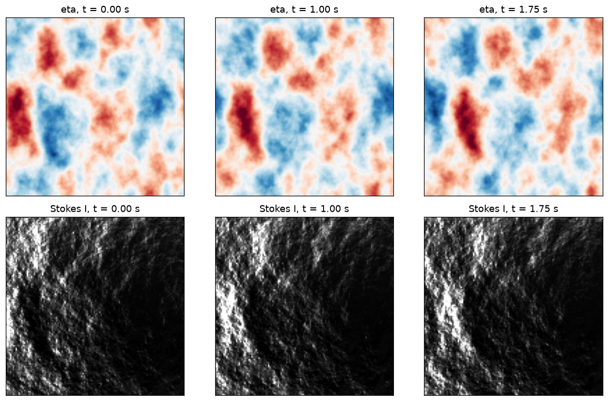
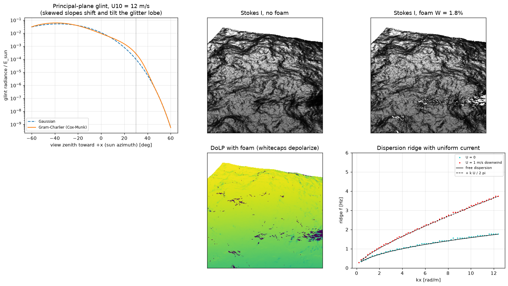
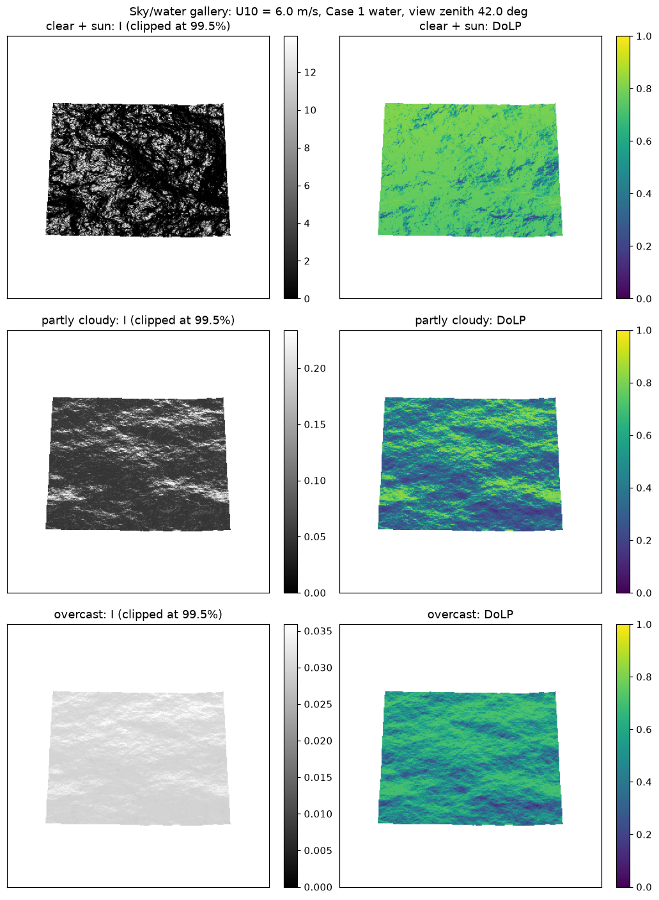

## Near-surface scattering and color

| Script | What it shows |
|---|---|
| `demo_near_surface_scattering.py` | From mirror to water: S0 and DoLP with specular reflection only, with the first-order isotropic water term, and with the in-water Monte Carlo upwelling table (view-dependent water brightness, physically placed DoLP damping); the sub-surface light field L_u(mu_w, phi) itself with its anti-solar brightening. Caches `output/upwelling_coastal_550.npz`. |
| `demo_color_scenes.py` | Color-aware rendering at 450/550/650 nm: clear-sky blue ocean, green productive Case 1, gray-green overcast coastal Case 2, partly cloudy with a bubble layer, warm low-sun glint; plus Monte Carlo sub-surface reflectance spectra per water type (blue peak for clear water, green shift with chlorophyll and CDOM). Caches per-band tables under `output/color_tables/`. |
| `demo_stokes_panels.py` (table) | 1 x 3 grayscale Stokes panels (S0, S1/S0, S2/S0) of the full Elfouhaily + FM98 capillary blend on a 1024$^2$ / 1 m patch, swept over U10 = 3-15 m/s (one figure per wind in `output/stokes_panels/`); runs on the GPU when available. |

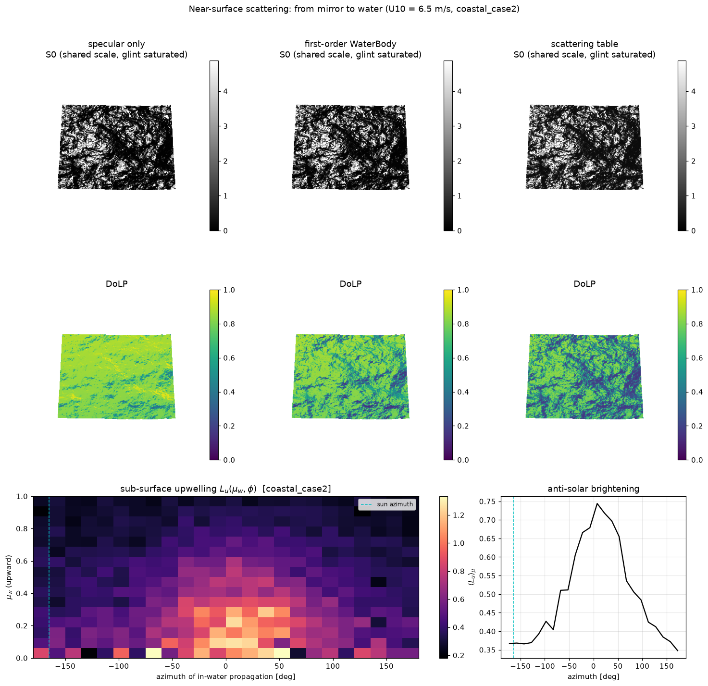
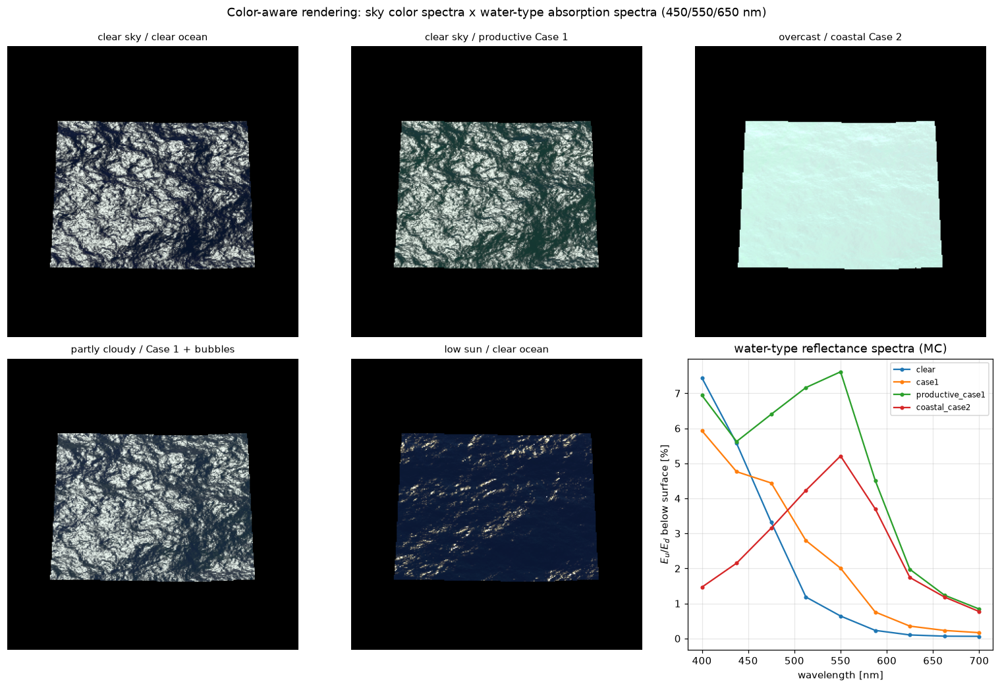
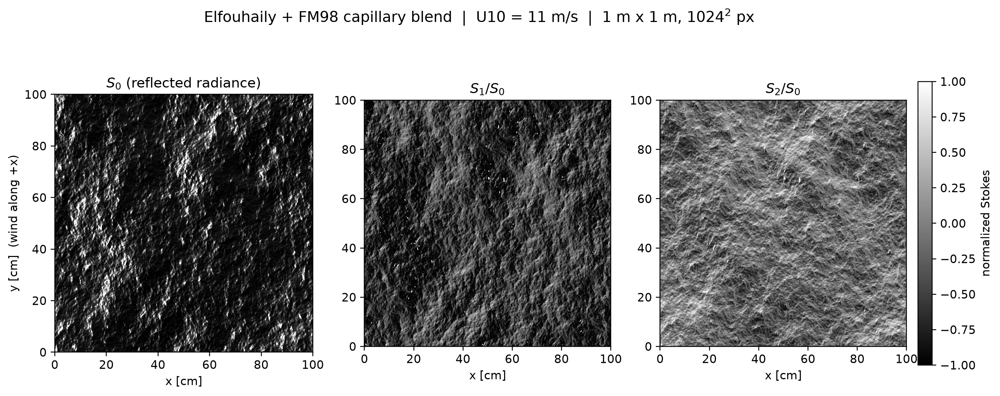

### Video tools (standalone; not in `run_all`)

These write mp4s to `output/videos/` via ffmpeg and take several GPU
minutes each (output files are large), so they are run explicitly
rather than as part of the gallery sweep.  They render frames on the
GPU and pipe raw RGB to libx264; each video is written atomically, so a
run is resumable.

| Script | What it shows |
|---|---|
| `demo_stokes_video.py` | S0, S1/S0, S2/S0 of the time-evolving Elfouhaily + FM98 blend on a 1 m / 1024$^2$ patch. `--sim-fps`/`--play-fps` decouple the simulation rate from playback for slow motion (sim above the playback rate resolves the fast capillary motion); `--domain` sets the patch size. |
| `demo_asit_stokes_video.py` (ASIT) | Instrument-matched Stokes videos driven by the **measured** ASIT directional spectra (2.9 m FOV, 2048 px, 30 deg incidence). Short waves are band-limited to the camera's reliable resolution (~150 rad/m / 15 Hz) and evolved **bound** to the longer waves (monotone ramp), rendered as slow motion so the bound short-wave motion is coherent rather than aliased. |
| `demo_color_scenes_video.py` | 60 s video form of `demo_color_scenes`: the five sky/water scenes evolving over one shared wave field, reusing the cached per-band scattering tables. |

A frame from `demo_asit_stokes_video.py` (measured day025 spectrum,
U10 = 10.7 m/s; S0, S1/S0, S2/S0):

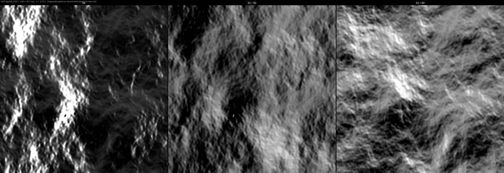

A frame from `demo_color_scenes_video.py` (five sky/water scenes
evolving over a shared wave field):

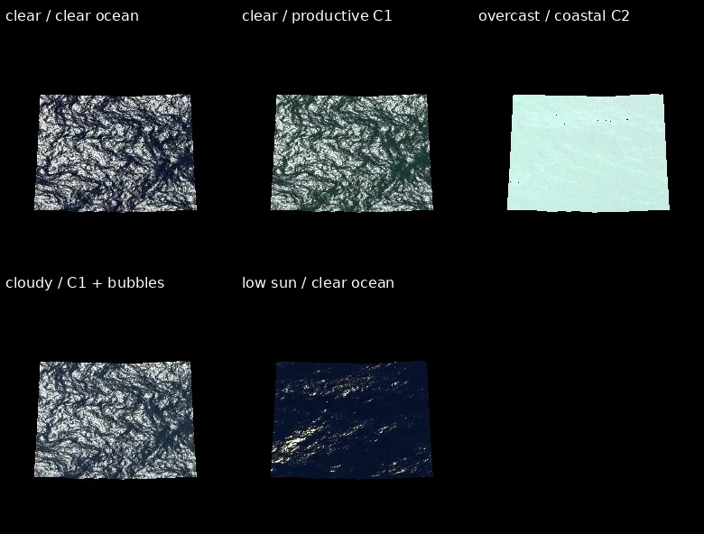

## Monte Carlo radiative transfer

| Script | What it shows |
|---|---|
| `demo_mc_reflectance.py` | Forward Monte Carlo hemispherical reflectance vs incidence and wind against flat Fresnel. |
| `demo_mc_water_body.py` | In-water polarized scattering: energy budget vs single-scattering albedo, emergent water-leaving radiance vs the first-order isotropic model, DoLP damping by water-leaving light. |

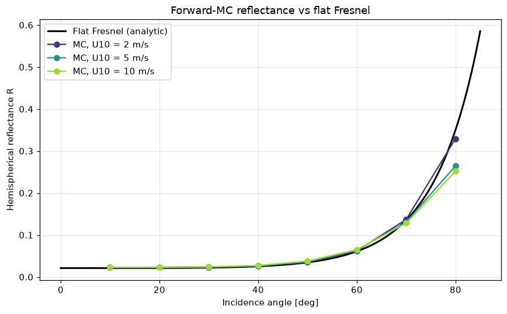
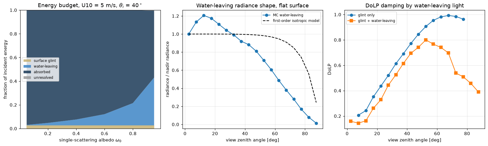

## Fedorov-Melville parasitic capillaries

| Script | What it shows |
|---|---|
| `demo_fm98_capillaries.py` (table) | Direct FM98 profiles on the well-forced branch (Melville & Fedorov 2015 figure-2 structure: train on the forward face, decaying into the trough, steepness to ak ~ 0.32-0.375) and the phase-locked hybrid surface: curvature packets locked to carrier crests, phase-binned energy vs long-wave phase. |
| `demo_fm98_crest_stokes.py` | Hero demonstration: 0.1 mm resolution FM98 steep crest; Stokes I, Q/I, U/I, DoLP, AoP transects and 2D strips showing the polarimetric banding of the parasitic capillaries. |
| `demo_fm98_3d_placement.py` (table) | Local (3D-appropriate) capillary placement: local carrier wavenumber map, bound-harmonic curvature zoom, and conditional ripple spectra showing the resonance inversion k_rip ~ k_m^2/k_loc that the band-averaged scheme cannot produce. |
| `demo_slope_statistics.py` (table) | MSS, slope skewness, and excess kurtosis of linear vs hybrid surfaces; Cox-Munk classical references (shape emerges from Elfouhaily + FM98, not fitted). |

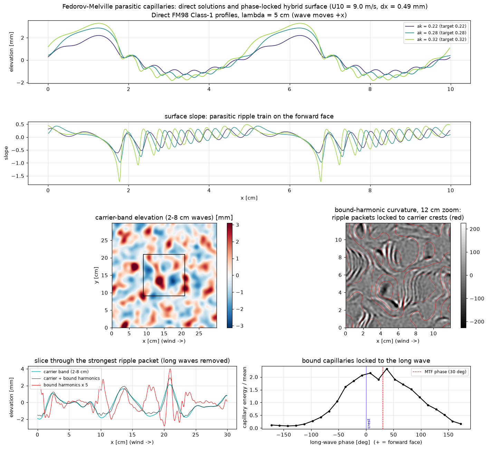
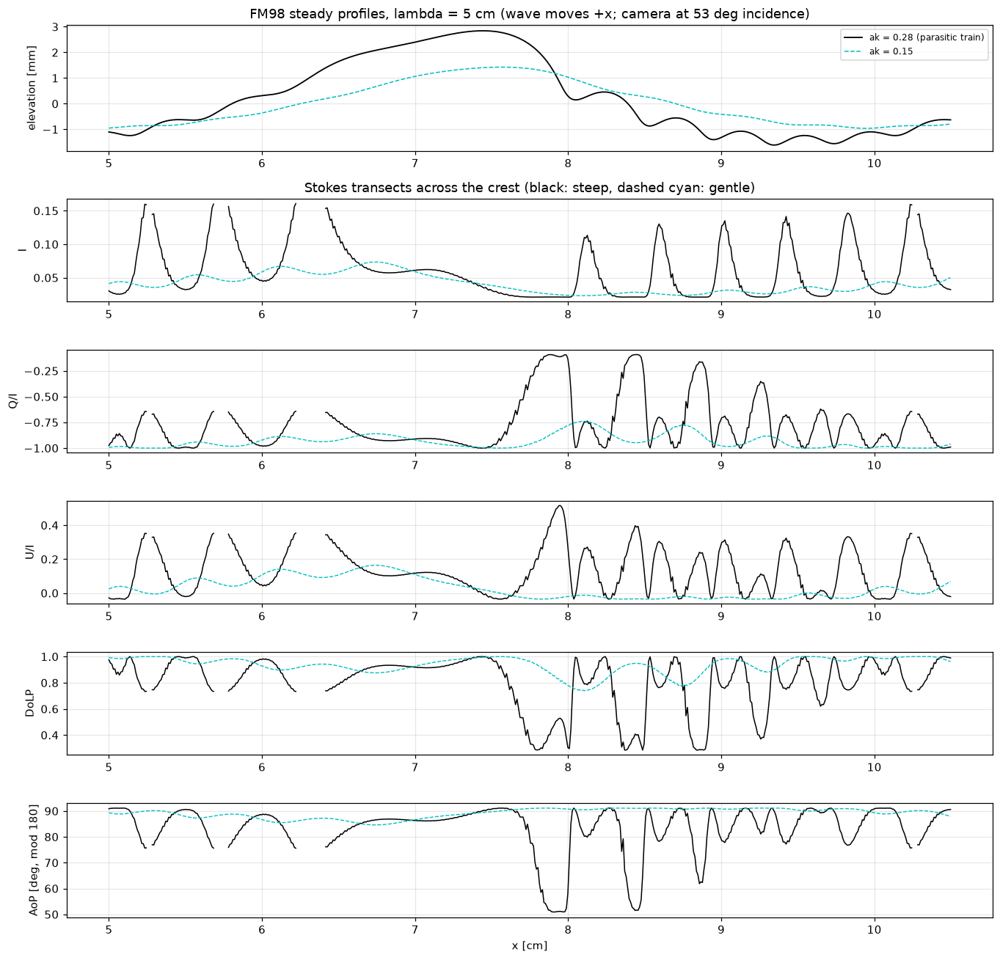
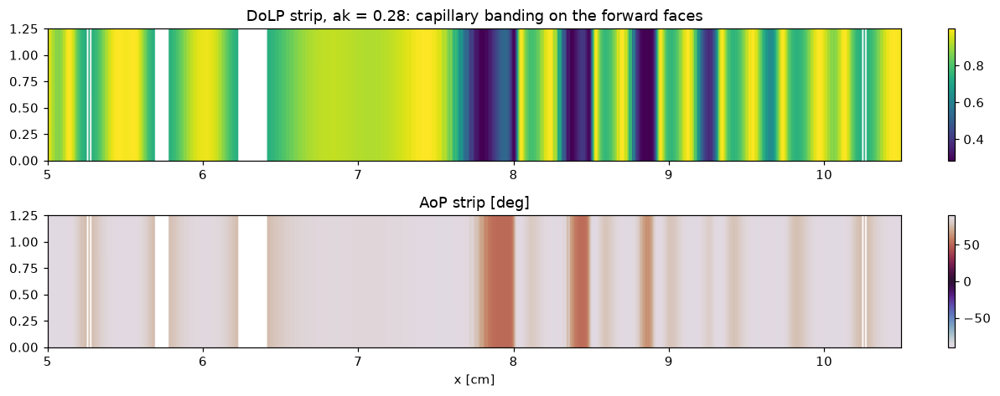
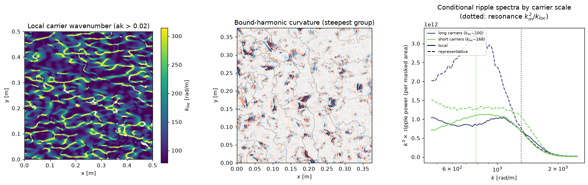
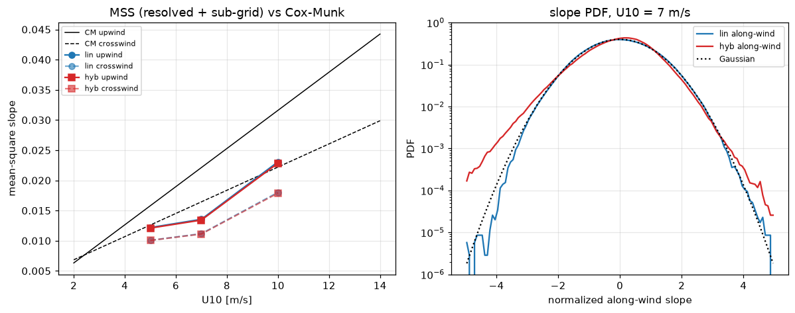

## Wavenumber-frequency validation and ASIT 2019

| Script | What it shows |
|---|---|
| `demo_kw_spectrum.py` (table) | Slope k-f spectra and Q(nu) of free-only vs hybrid synthesis with the measured bound ridge and Q(nu) overlay; Blackman-Harris diagnostics. |
| `demo_asit_dispersion.py` (ASIT) | Streams a raw 6.9 GB Skw(f, kx, ky) cube: measured dispersion diagram with noise-floor subtraction and the off-shell bound fraction beta_obs(k). |
| `demo_beta_library.py` (ASIT) | The library: measured beta(k) colored by wind speed and the wind-interpolated curves used by the synthesis. |
| `demo_asit_surface.py` (ASIT) | Surface synthesized from a measured directional slope spectrum: spectrum-form comparison, slope PDFs (instrument histogram for context only), rendered imagery. |
| `demo_full_pipeline.py` (table, ASIT) | Capstone: measured spectrum + measured beta + FM98/MTF/orbital advection time evolution; rendered movie (GIF) and same-run Q(nu) comparison. |

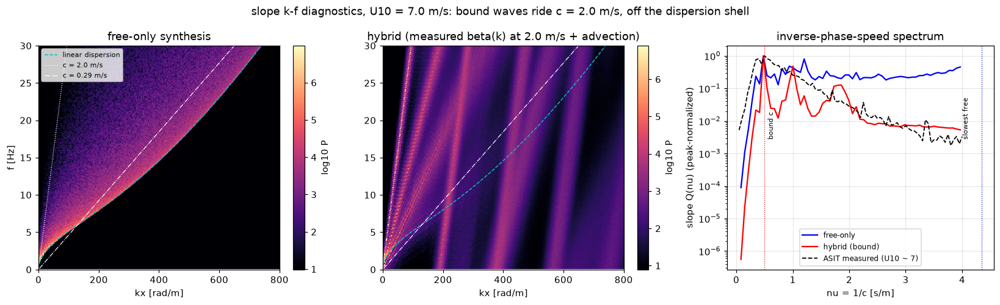
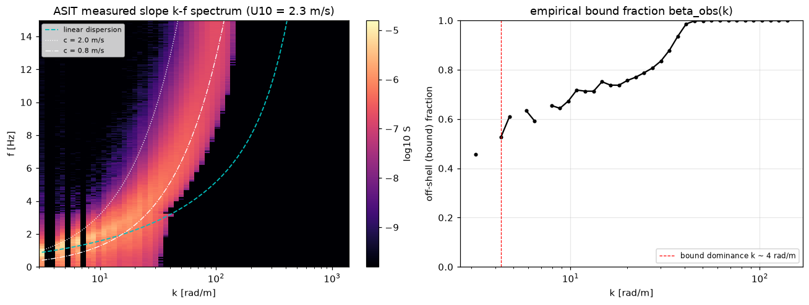
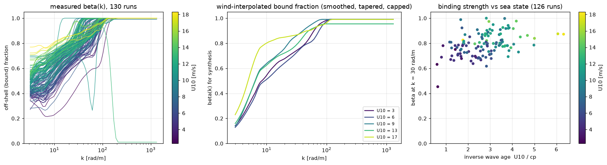
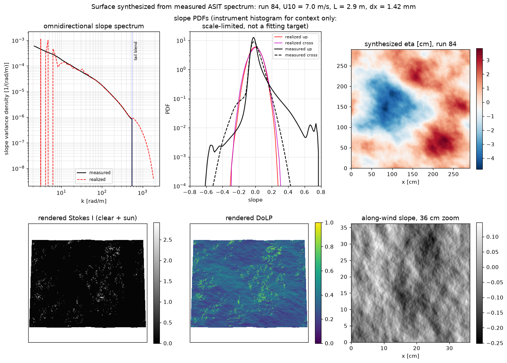
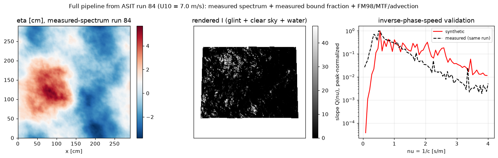
